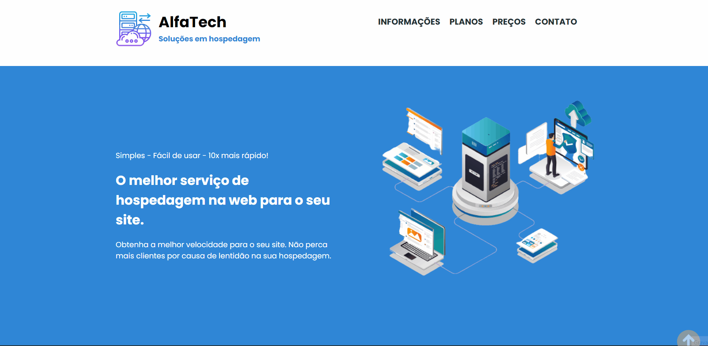

# AlphaTech - soluções em hospedagem
> Status do Projeto: ✔️ (concluido✅)

### Tópico
-[Descrição do projeto](#descrição-do-projeto) 
-[Linguagens utilizadas](#liguagens-utilizadas) 
-[Sobre e futuras melhorias](#sobre-e-futuras-melhorias)

## Descrição do projeto

Projeto proposto pela DevMedia: construção de uma Webpágina para uma empresa de hospedagens com navegação entre telas.

A página possui duas telas uma página home e a outra uma página de tabelas de preço, ambas as página possuem navegação entre si e navegação com os links da página para facilitar a navegação, além de contar com uma seta flutuante que leva ao inicio da página. 

## Linguagens utilizadas
>HTML

>CSS

### Sobre e futuras melhorias

A principal tag utilizadas foi o CSS position (estudo atual) e uma melhoria a ser feita será mudar para o flexbox, conforme for aprendo irei está fazendo as adaptações para deixa-lo o mais realçado possivel e mais responsivel.

